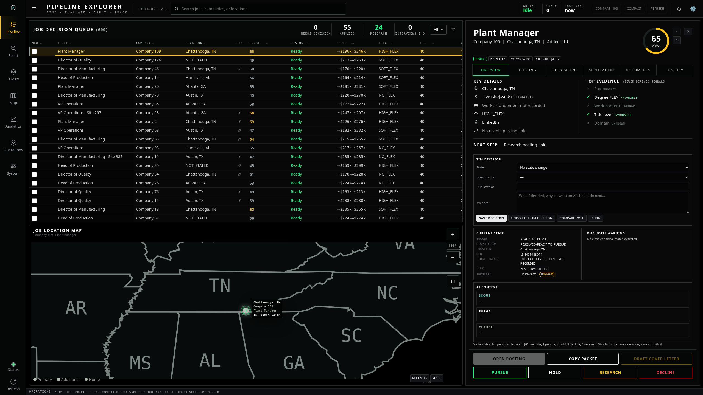
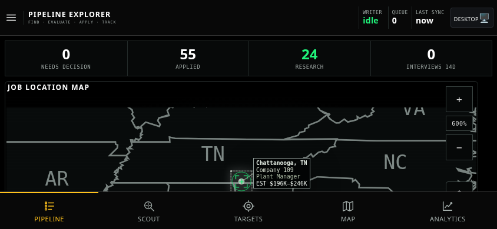
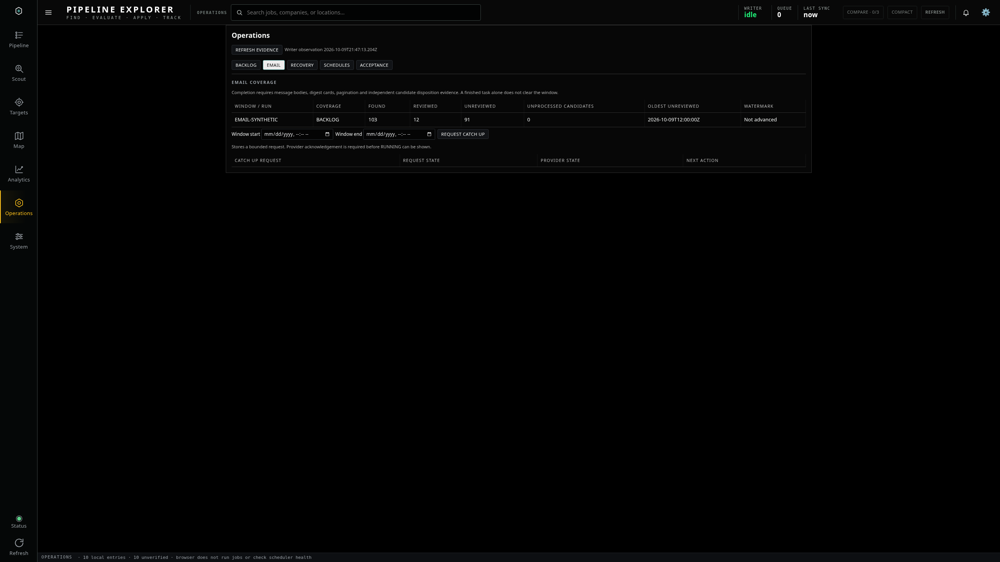
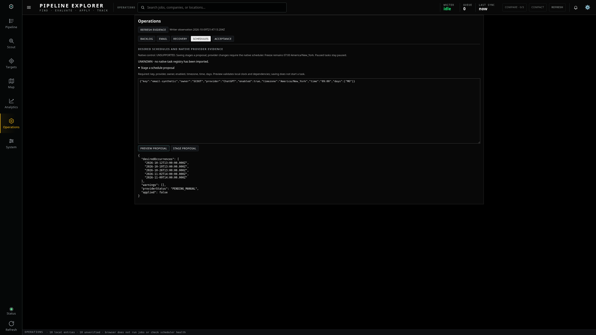
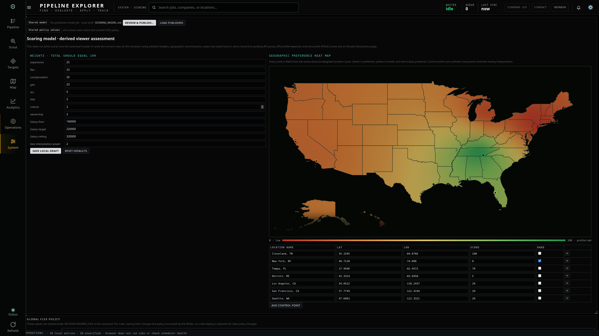

# PR70 GUI review

**[Latest: revision 2 — larger fonts, more padding, and FLEX controls at the top](revision-2/README.md)**

These are screenshots of the modified working application using isolated synthetic fixtures. They are review evidence; the visual application changes are still uncommitted and not deployed.

Desktop shows 19 visible rows. Map geometry matches the recovered baseline. Mobile views are browser emulations; physical iOS safe areas are not certified. The original owner screenshot comparison remains unavailable.

Click any image to open its full resolution version.

## Desktop — 2560 × 1440

## Phone — portrait

## Phone — landscape left

## Phone — landscape right

## Operations — email coverage

## Operations — schedule proposal

## Scoring and FLEX policy

## Approval

Reply in the Codex conversation with **GUI approved**, or describe requested changes. The supplied execution order requires approval before committing or deploying visual changes. Apps Script deployment also requires an authenticated deployment login.
