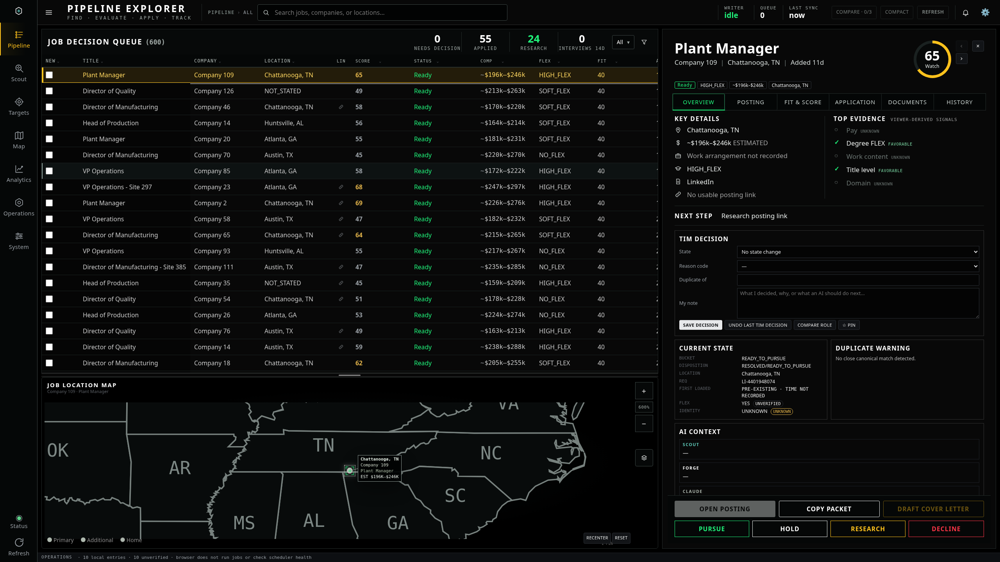
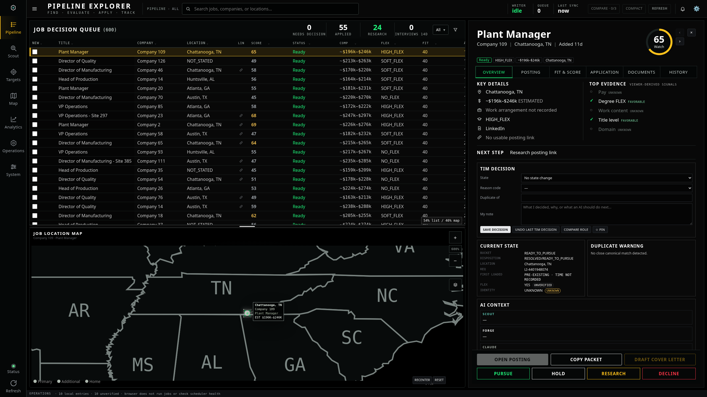

# Adjustable list/map divider

Default desktop layout: **65% list / 35% map**. Drag the horizontal grip between them to resize. The split is saved on this device and restored after reload. Arrow keys adjust by 2%; Shift + arrows adjust by 5%; double-click restores 65/35. Minimum pane sizes keep the controls usable on shorter screens. Touch phone layouts retain their scrolling layout.

These are actual Chromium screenshots at **2560 × 1440**, using 600 synthetic jobs. No production data was changed. Visual application changes await GUI approval before commit/deployment, as required by the supplied execution order.

## Default

## After dragging upward to enlarge the map

Browser checks cover dragging, keyboard adjustment, saved split after reload, restoring the default, desktop and phone layouts, and zero horizontal overflow.
