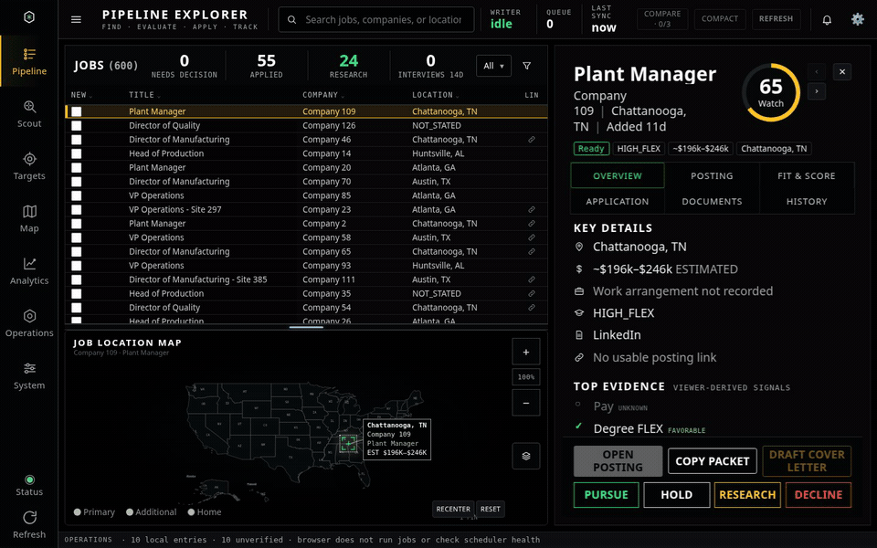
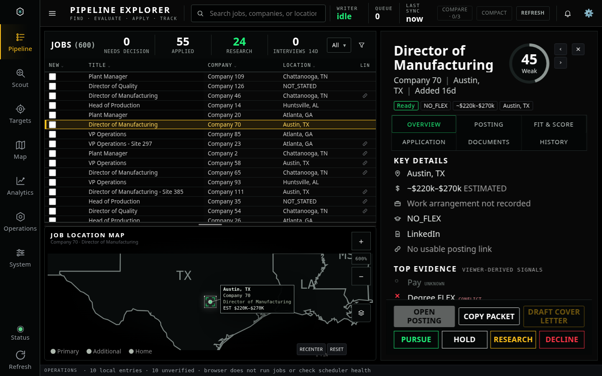

# Instrument-console interaction preview

The motion follows an **acquire → inspect → act** sequence, with restrained holographic cyan accents.

- Selecting a different job briefly traces the workspace header, sweeps the score ring to the actual score, and reveals detail sections in sequence. The score number stays stable.
- Detail-tab changes use a short reveal. Map descriptions and their leader lines acquire softly when the location changes.
- Hovering or focusing the list/map divider expands its illuminated grip and shows the current split. Dragging gives the handle a stronger active state. New devices see a brief invitation pulse.
- Focused editing panels get an illuminated edge, and enabled action buttons respond to hover and press. Disabled controls retain their disabled appearance.
- A thin amber scan appears while the canonical master is actually loading. It stops when loading completes or fails; it represents activity, not measured progress or write verification.

Animations cancel for reduced-motion preferences and hidden tabs. Reduced motion retains static focus, divider and loading cues. Content remains readable, controls respond immediately, and layouts retain the larger text and 55%/45% default.

## Watch the walkthrough

[Download the full-resolution MP4](walkthrough.mp4)

The walkthrough demonstrates job selection, detail tabs, field focus, divider adjustment/reset, another job selection, and a delayed synthetic refresh. All data is synthetic. External requests were blocked; device-state sync was mocked and no canonical writes occurred.

## Desktop

Checks passed for real-score animation, detail tabs, input focus, divider interactions, loading state, and switching reduced motion on while an animation is running. The normal desktop/mobile workflow and workspace clipping regressions also passed.

Visual application changes await GUI approval before commit/deployment, as required by the supplied execution order.
