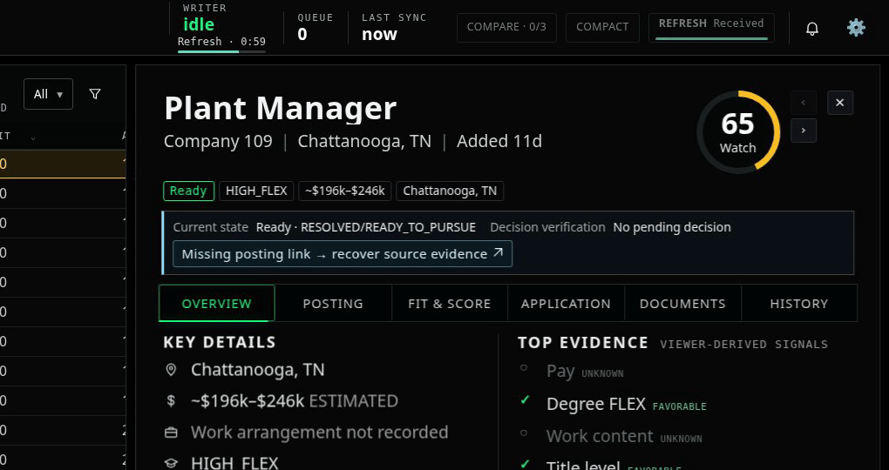
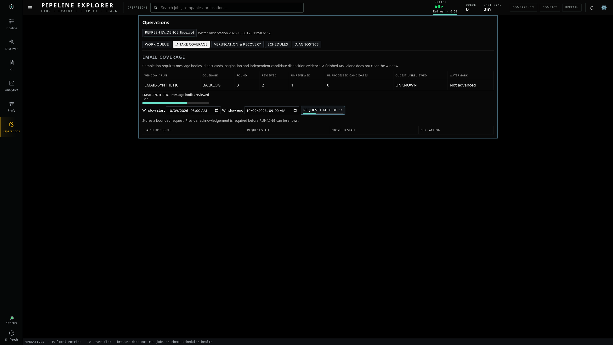

# Writer countdown and command progress preview

Actual browser captures using 600 synthetic jobs and mocked Writer responses. External requests were blocked. No production jobs, instructions, schedules or deployment were changed. Visual application source remains pending GUI approval.

## Writer refresh countdown

The header and System panel show seconds remaining and a shrinking bar until the next automatic Writer **status** refresh. The timer resets after a refresh completes, including a failed refresh; active requests display Checking. Hidden pages pause automatic refresh, and returning checks immediately. Manual refreshes share an active request instead of overlapping it. The canonical job master still refreshes separately.

The animation is cropped from a real 2560 × 1440 browser capture for readability.

## Command controls and measured work

Compact bars appear directly on controls while network requests are pending, with elapsed seconds. Rules and company-registry publishing retain progress through fresh readback. Medium coverage bars use actual reviewed-body counts; the wider work-queue bar uses independently resolved tracked obligations. Unknown durations remain indeterminate. Queued research and Catch Up requests use static amber waiting stripes rather than invented completion percentages. Request acceptance does not imply a native AI task has finished.

## Full desktop and phone views

[2560 × 1440 desktop](progress-countdown-2560.png) · [390 × 844 phone](progress-countdown-390.png)

## Validation

Focused browser checks passed for countdown timing, automatic/manual reset, no overlapping refresh requests, failure retry, hidden pause/resume, unknown-duration controls, readback phases, queued-job isolation and reduced-motion support. Five viewport layout checks and the broader browser regressions passed with no browser errors. Existing intake and company-registry contract tests passed.

[Focused synthetic evidence](progress-evidence.json)
