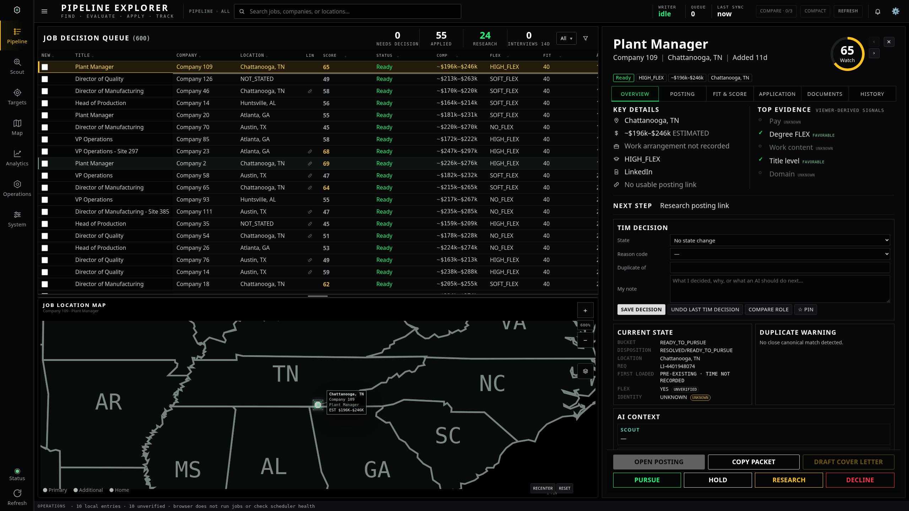
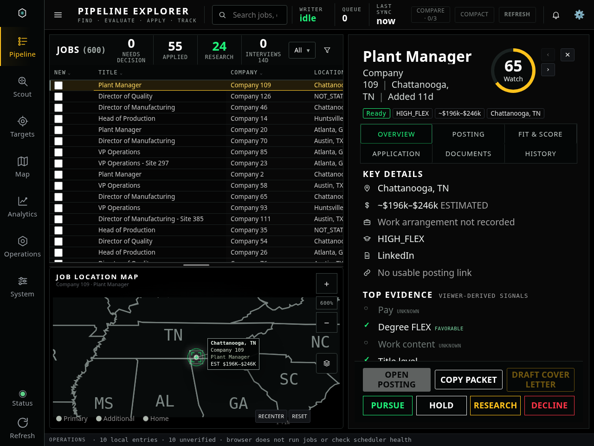
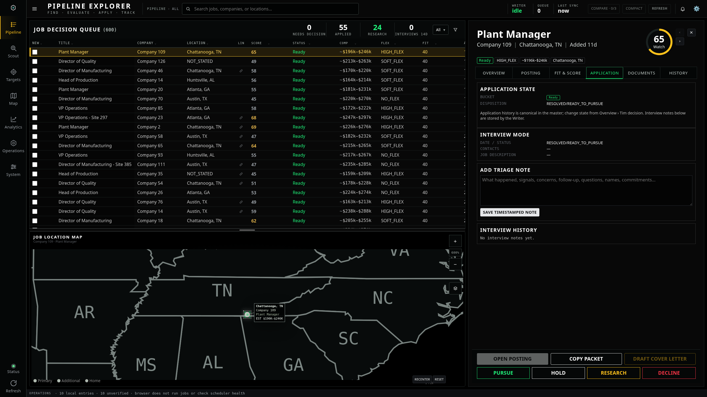
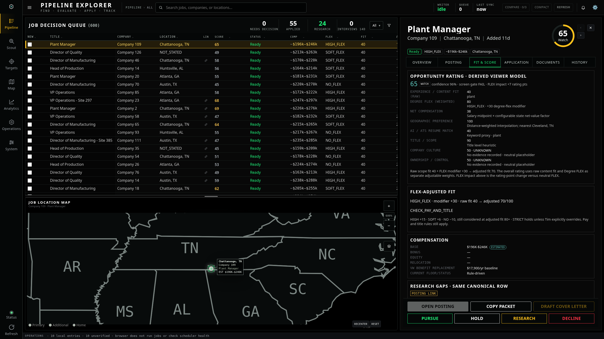
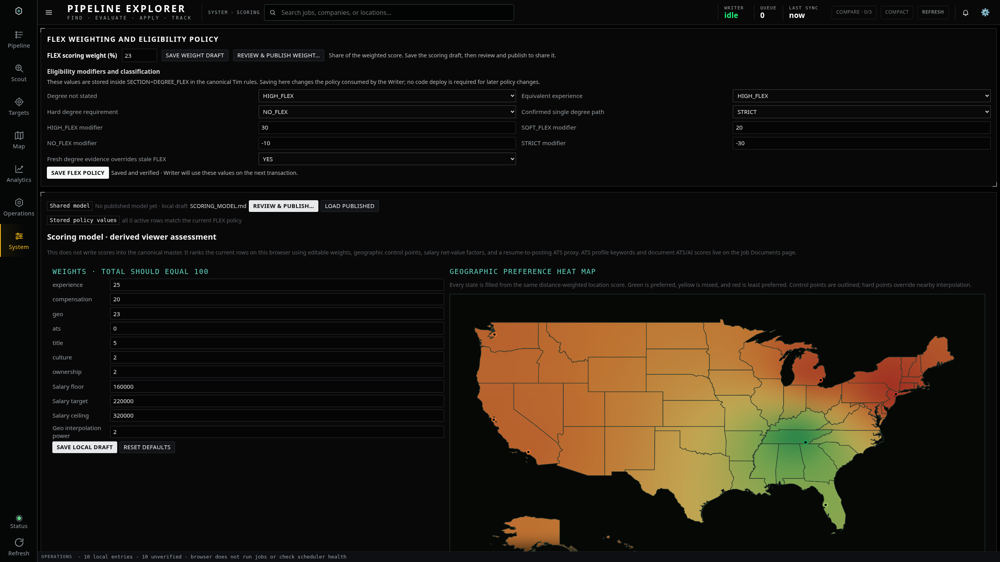
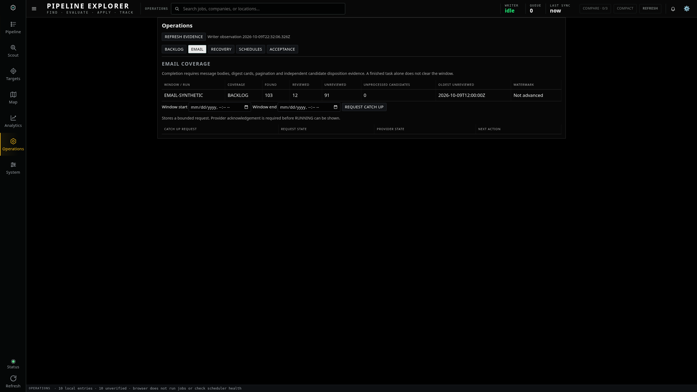
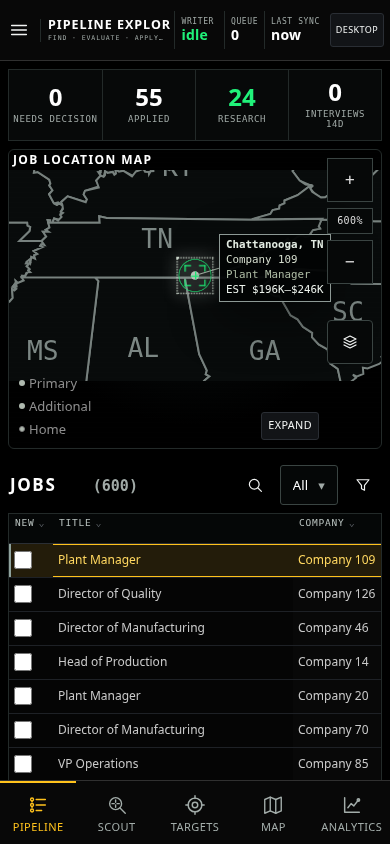

# Larger workspace and supporting text

Small desktop workspace text is approximately 15% larger than the preceding preview, including state details, labels, badges, editing controls and help text. Other pages use the same increase for small supporting text. Large headings retain their size.

Status labels wrap to keep their complete text. Narrow desktop workspaces stack overview sections; the detail body scrolls while action controls stay available. Action names wrap between words rather than splitting letters. Desktop list/map default is 55%/45%; the popup leader is 20% longer.

These are actual Chromium screenshots with synthetic jobs. Application visual changes remain pending GUI approval before commit/deployment, as required by the supplied execution order.

## Desktop 2560 × 1440

## Desktop 1280 × 960

## Application status

## Fit and score

## Scoring

## Operations

## Phone

Browser checks cover all six workspace tabs at both desktop sizes, clipped status text, workspace overflow, split dragging and persistence, scoring controls, operations panels and phone orientations. The broader browser regression also passed at desktop, smaller desktop, portrait and landscape viewports.
