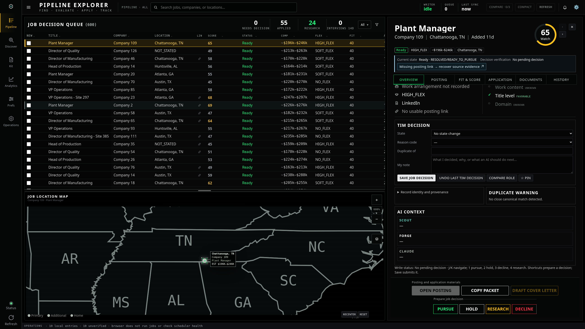
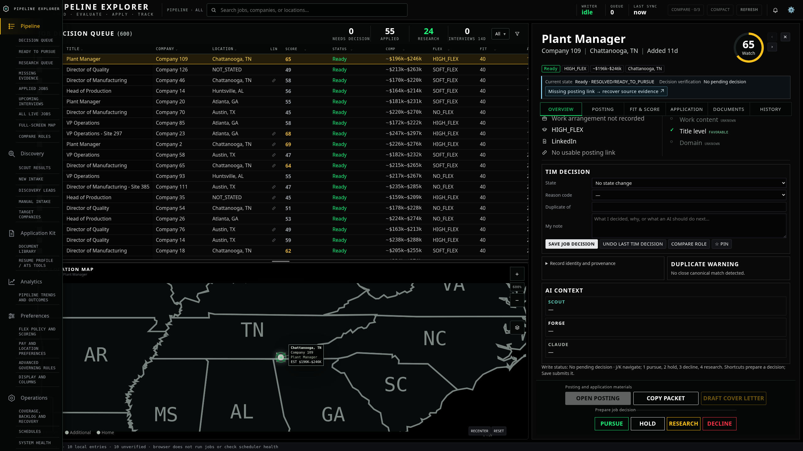
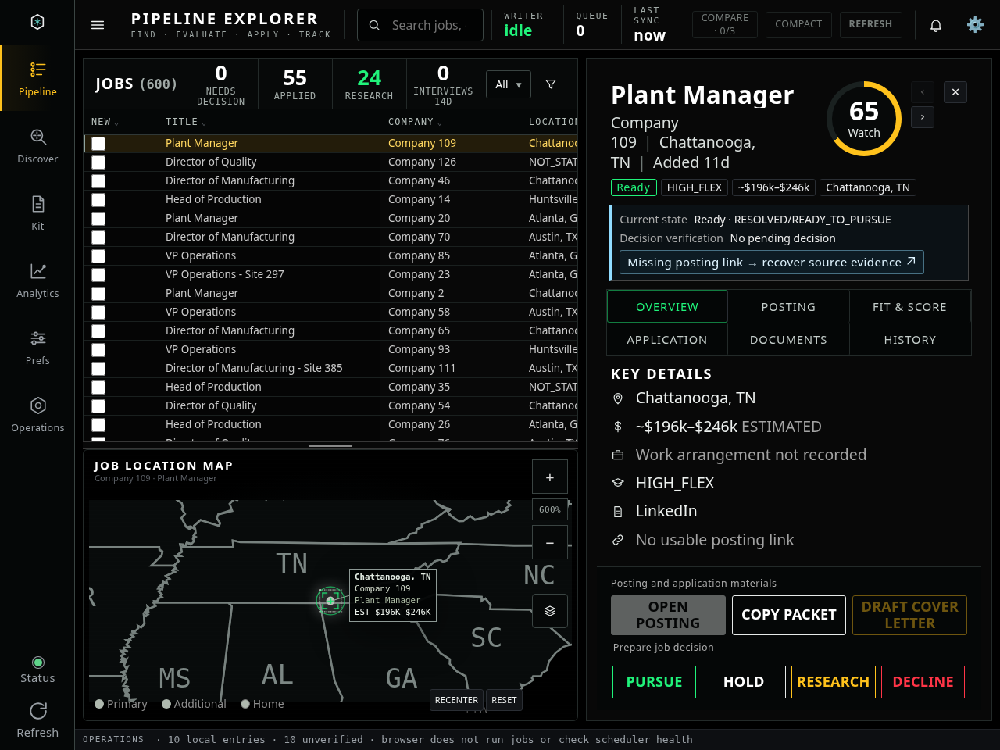
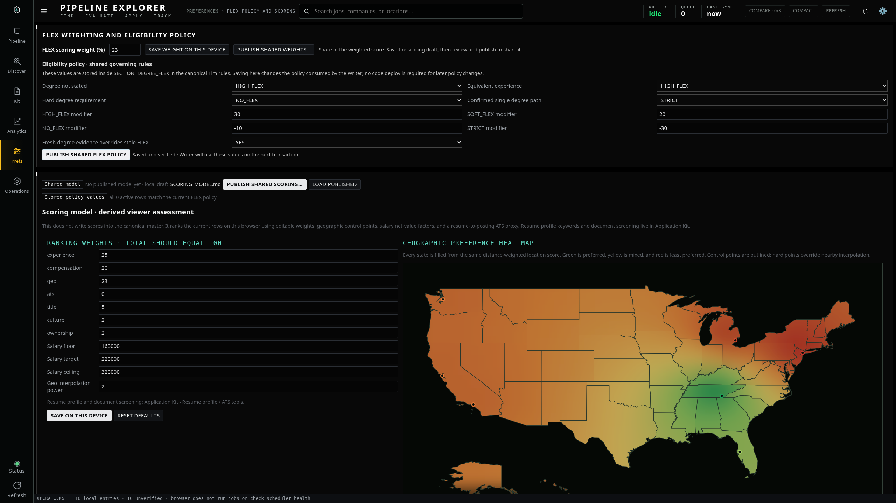
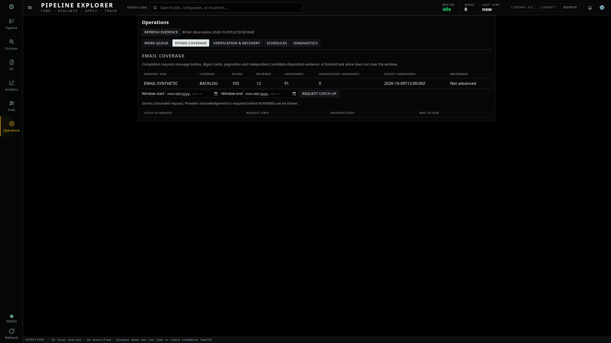
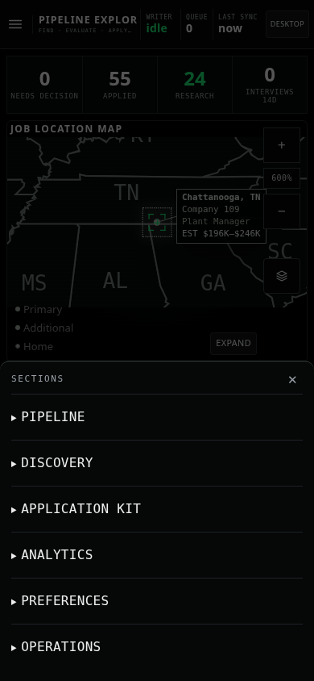
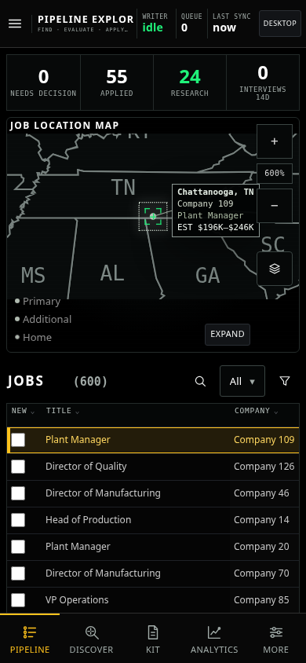

# Workflow organization

Desktop and phone now share six feature groups. The phone menu presents all six sections before expanding their functions:

| Group | Functions |
| --- | --- |
| Pipeline | Decision queue, ready jobs, research, missing evidence, applied jobs, upcoming interviews, full-screen map, comparison |
| Discovery | Scout results, new intake, discovery leads, manual intake, target companies |
| Application Kit | Document library, resumes, cover letters, resume profile and ATS screening |
| Analytics | Pipeline trends, application outcomes, location comparisons |
| Preferences | FLEX eligibility policy, ranking weights, pay and location preferences, advanced rules, display and columns |
| Operations | Work queue, intake coverage, verification/recovery, schedules, diagnostics, system health, Writer connection |

Job workspaces show current state, decision verification, recorded blockers and a clickable next step above all six detail tabs. The shortcut opens the relevant existing control. Record identity and provenance remain available in an expandable section. Action groups distinguish posting/application materials from preparing a job decision. New jobs and detail tabs start at the top; background redraws keep the current reading position.

Buttons distinguish **Save on this device**, **Publish shared scoring/policy**, and **Save job decision/evidence**. FLEX eligibility and ranking remain separate sections within Preferences. The resume profile has one editor in Application Kit; resetting it preserves custom weights and location preferences, and device edits survive loading the shared model.

Operations navigation now renders its content directly. System Health and the rail Status shortcut stay open instead of being immediately dismissed by the outside-click handler.

## Desktop 2560 × 1440

## Expanded navigation

## Desktop 1280 × 960

## Preferences

## Operations

## Phone sections

## Phone workspace

All screenshots use synthetic data with external requests blocked. Checks cover the six navigation groups on desktop/phone, next-step focus, expandable provenance, profile save/reset without changing custom weights, preference/schedule shortcuts, system health, comparison, all six workspace tabs, clipping/overflow, existing job decisions and map workflows. Motion and reduced-motion checks also pass. No production data was changed.

Visual application changes await GUI approval before commit/deployment, as required by the supplied execution order.
