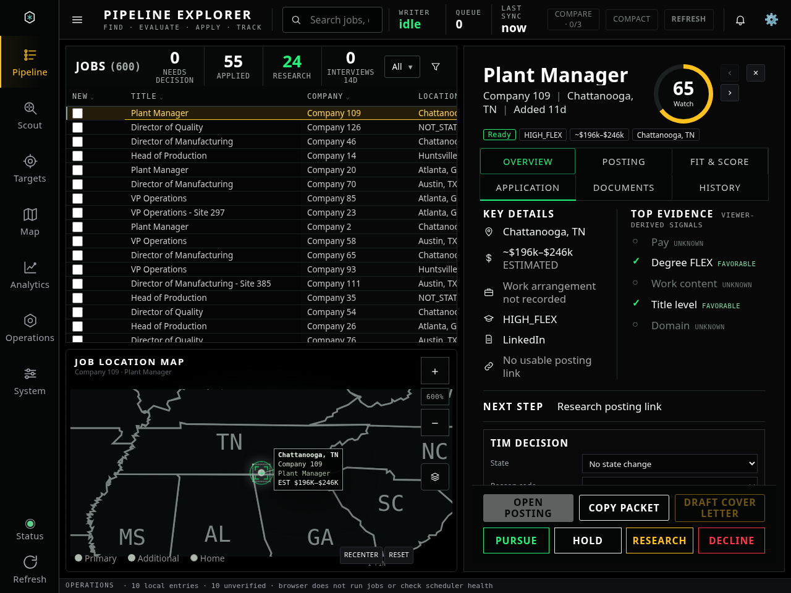
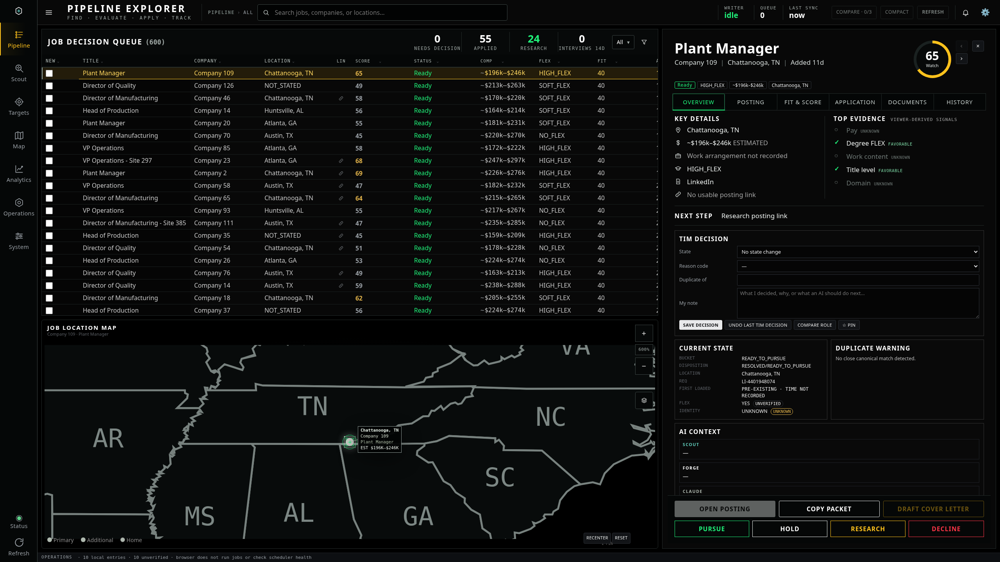
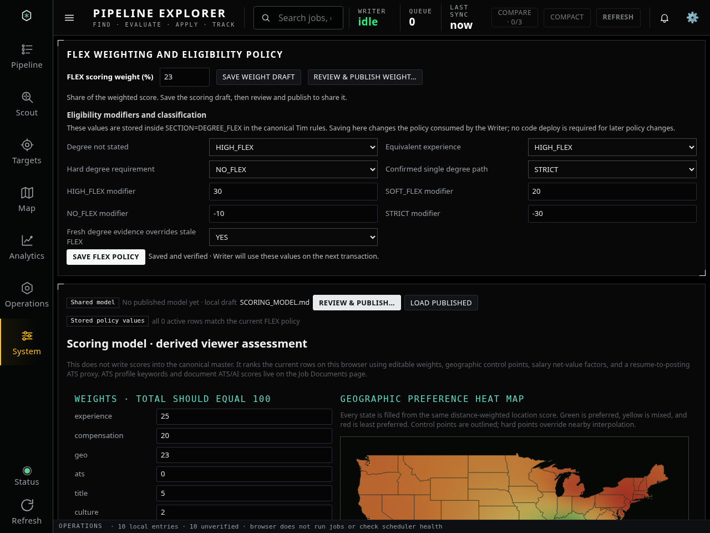
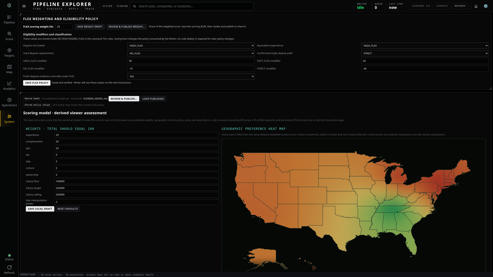
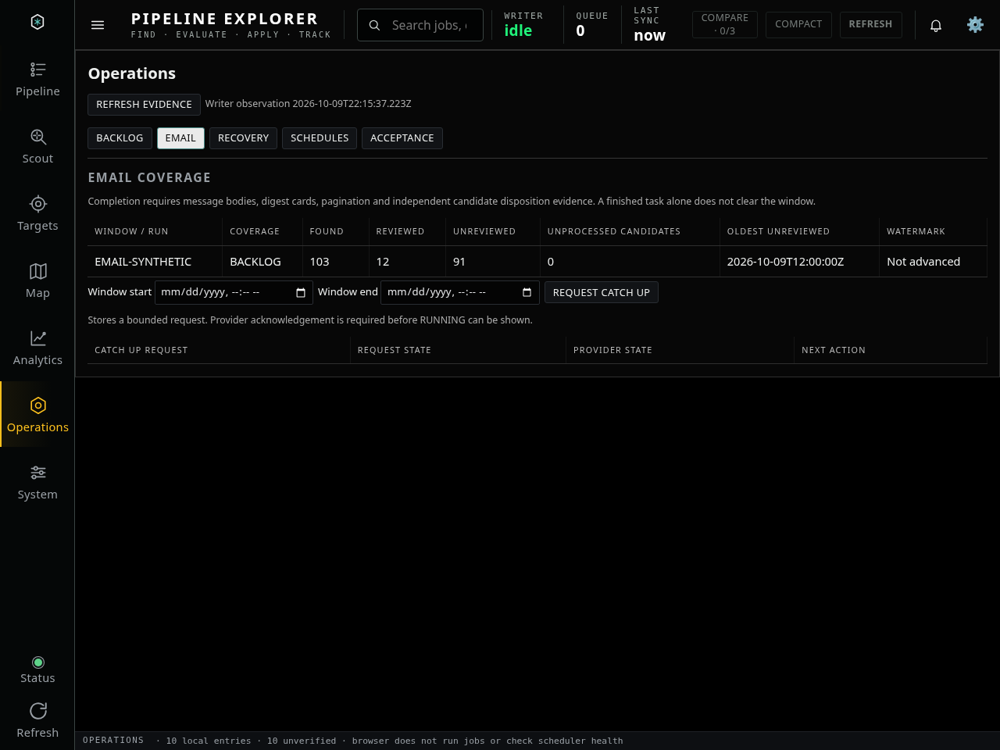
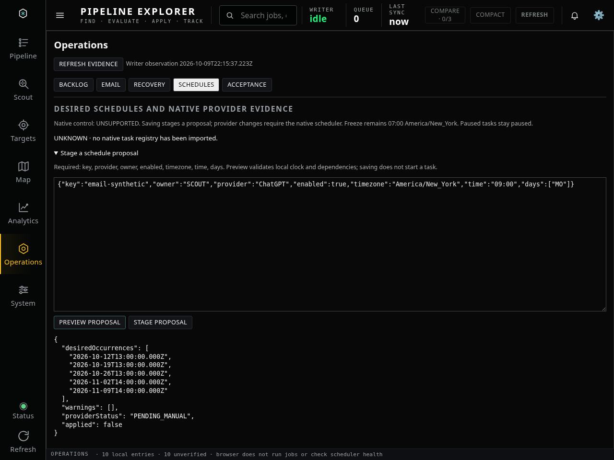
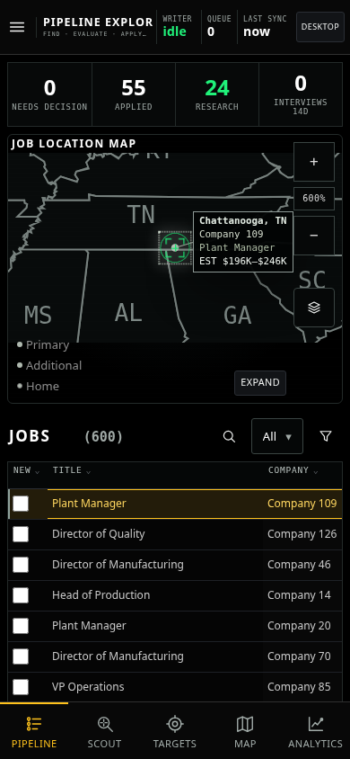
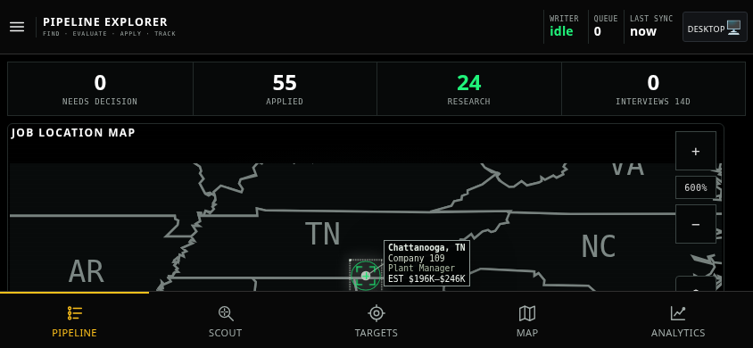

# PR70 GUI review — revision 2

This revision addresses the requested desktop typography and spacing changes. Desktop text is approximately 12.5% larger, with about 10% more interior padding. The 2560 × 1440 view still has 19 visible rows and the recovered baseline map has exactly the same position and dimensions.

Scoring now opens with **FLEX weighting and eligibility policy**. The editable **FLEX scoring weight (%)** is shown with its own Save weight draft and Review & publish controls. HIGH_FLEX, SOFT_FLEX, NO_FLEX and STRICT eligibility modifiers are directly below. Score weight and eligibility modifiers are separate settings.

These are screenshots of a working application using synthetic fixtures. The demonstrated draft-save and policy-save/readback checks use local service doubles; no production policy or job data was changed. Application visual changes remain uncommitted pending preview approval. Physical iOS safe areas are not certified.

Click any screenshot to open its full resolution version.

## Desktop — 1280 × 960

## Desktop — 2560 × 1440

## Scoring — FLEX controls visible at the top

## Scoring — 2560 × 1440

## Operations — email coverage

## Operations — schedules

## Phone — portrait

## Phone — landscape left

## Phone — landscape right

## Approval

Reply in Codex with **GUI approved**, or describe changes. The execution order requires preview approval before committing or deploying visual application changes.
